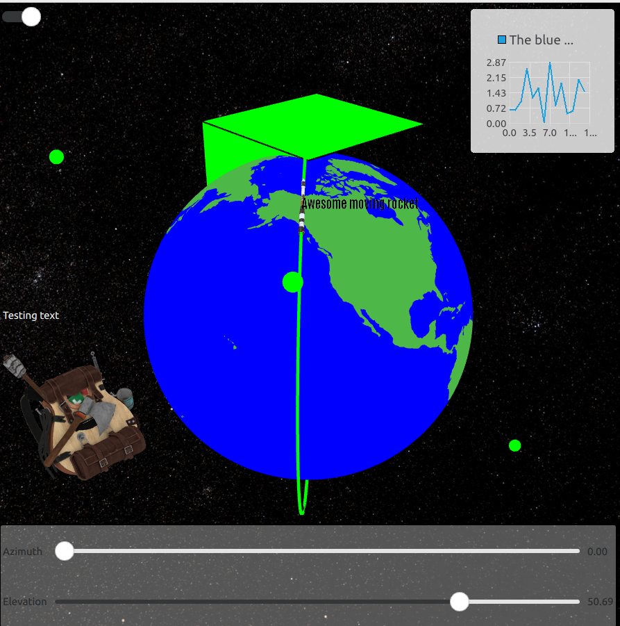
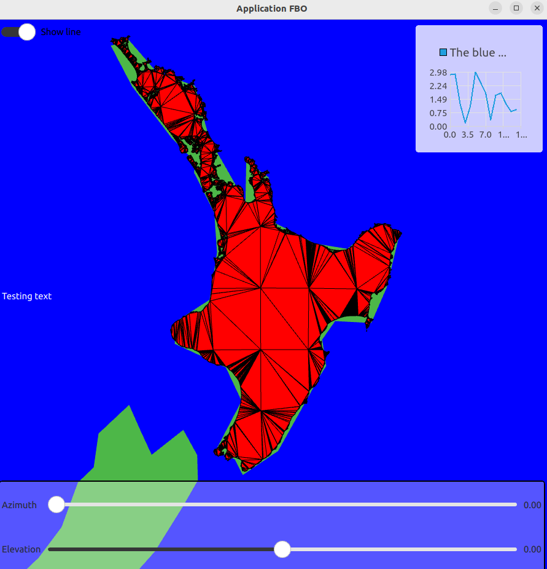

# OpenGL QT Playground

Welcome to my OpenGL QT playground. The code here has been written as a demonstrator and test platform for OpenGL components rendered inside the QT framework. The repository being a test platform lacks a lot of documentation, functionality and is far from clean or optimised. However it displays a wide variety of raw openGL 3.3 code implementations that can be used in a vast array of 3D based applications. Some of the main features include:

* An openGL framebuffer environment hosted inside the QT windowing system
* Complete implementation of the C++ openGL rendering pipeline from vertex arrays, array buffers, vertex attribute pointers, vertex/geometry/fragment shader programs, uniforms, blending functions and face culling.
* The ability to load complex geometry made up of muliple meshes inside a openGL framebuffer with a wrapper around the assimp library
* The ability to control the entire graphics openGL pipeline from vertex to fragments using GLSL shaders
* Real time transformations (translation, rotations, scaling) of geometry using the eigen and openGL glm mathematics libraries 
* Classes for the rendering and construction of simple geometry such as lines, triangles, polygons, cuboid and ellipsoids
* Ray-tracing intersection of simple 3D objects using circle intersection, Object Bounding Boxes and Ellipsoid intersection algorithms
* An orbital camera to control the properties of the view matrix 
* A constrained 2.5D Delaunay Algorithm based on (https://github.com/artem-ogre/CDT) wrapped inside a rendering class used to construct complex surface meshes projected on surfaces such as a globe.
* User interaction of mouse clicking and sliding for camera control and ray intersection of objects
* 3D Text rendered using glyphs and billboards graphics for text wrappers
* A class implemented to create and render cubemaps for an immersive environment
* Automatic graphics resizing implementation through scaling of the projection matrix from the QT window properties
* Interaction with UI components created in the QML based QT framework to control rotations and visibility of components defined in the framebuffer object
* Multiple methods of using various stages of the shader graphics pipeline to allow special graphics effects such as fixed billboards and text relative to camera, geometry shaders to contruct meshes from vertex coordinates, using clip to space increase thickness of lines etc

Using the combined raw openGL graphics API and the powerful user interface QT framework, a large set of graphics application can be constructed from the impementations demonstrated here. 

# Demos and snapshots




Click on GIF bellow to access full video
[](https://youtu.be/h2WeD9wGdfo)

# Building application on Linux based environment (tested on Ubuntu 18 and 22)
The build system used for this project is meson. A few requisites packages and libraries are required to compile this project. To install these I recomend using a conda environment and installing the necessary packages using:

`conda install -c conda-forge cmake meson ninja`

or using the following command:

`sudo apt install cmake mesom ninja`

You will also need the assimp library which you can install using:

`sudo apt install libassimp-dev`

The last requirement is the installation of the QT framework. QT contains a large set of libraries and can be installed most easily using the offline installer from https://www.qt.io/offline-installers (5.12.x Offline Installers). If you opt to install QT using the offline installer you will need to link it to your package config and library path by adding the following to your `~/.bashrc`:

```
# QT
export PATH=$PATH:$QT_INSTALLATION_PATH/Qt/5.12.12/gcc_64/bin/
export PKG_CONFIG_PATH=$PKG_CONFIG_PATH:$QT_INSTALLATION_PATH/Qt/5.12.12/gcc_64/lib/pkgconfig/
export LIBRARY_PATH=$LIBRARY_PATH:$QT_INSTALLATION_PATH/Qt/5.12.12/gcc_64/lib/
export LD_LIBRARY_PATH=$LD_LIBRARY_PATH:$QT_INSTALLATION_PATH/Qt/5.12.12/gcc_64/lib/
```

Alternatively you can use you conda environment to install QT using
`conda install -c conda-forge qt`

Finally you can build and run the final application and external dependencies using the meson build system by running the following commands:

```
cd <project_directory>
meson build -Dbuildtype=release
ninja -C build
./build/application
```
