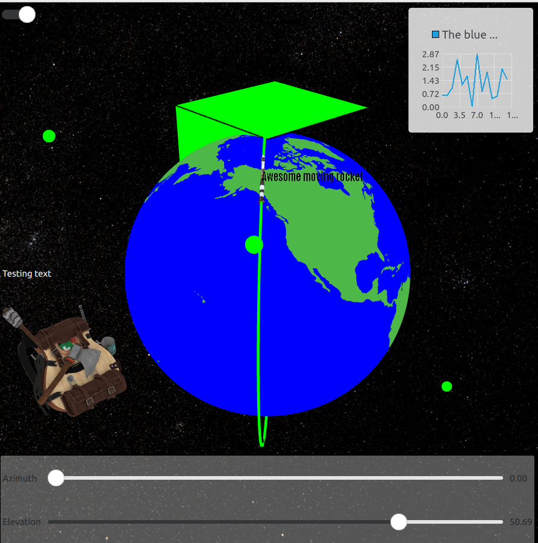
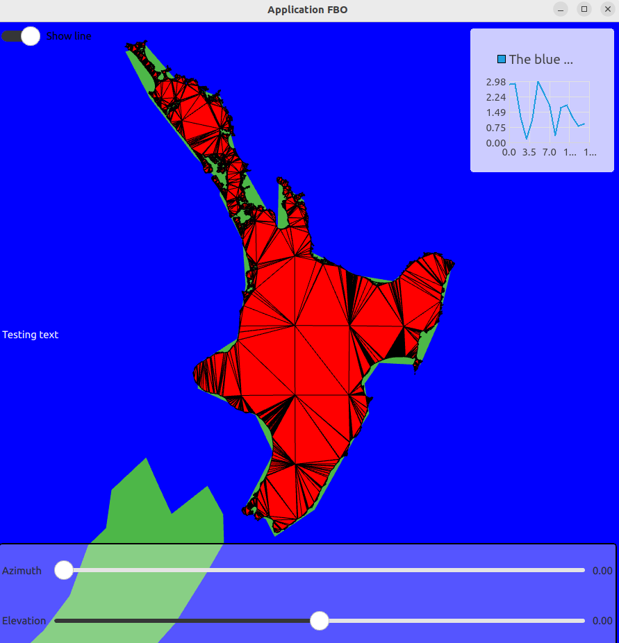
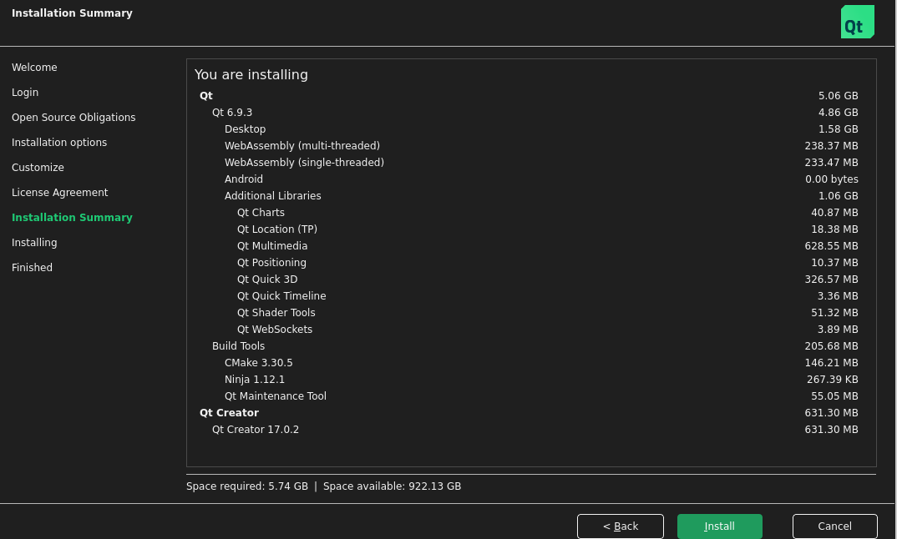

# OpenGL QT Playground

Welcome to my OpenGL QT playground. The code here has been written as a demonstrator and test platform for OpenGL components rendered inside the QT framework. The repository being a test platform lacks a lot of documentation, functionality and is far from clean or optimised. However it displays a wide variety of raw openGL 3.3 code implementations that can be used in a vast array of 3D based applications. Some of the main features include:

* An openGL framebuffer environment hosted inside the QT windowing system
* Complete implementation of the C++ openGL rendering pipeline from vertex arrays, array buffers, vertex attribute pointers, vertex/geometry/fragment shader programs, uniforms, blending functions and face culling.
* The ability to load complex geometry made up of muliple meshes inside a openGL framebuffer with a wrapper around the assimp library
* The ability to control the entire graphics openGL pipeline from vertex to fragments using GLSL shaders
* Real time transformations (translation, rotations, scaling) of geometry using the eigen and openGL glm mathematics libraries 
* Classes for the rendering and construction of simple geometry such as lines, triangles, polygons, cuboid and ellipsoids
* Ray-tracing intersection of simple 3D objects using circle intersection, Object Bounding Boxes and Ellipsoid intersection algorithms
* An orbital camera to control the properties of the view matrix 
* A constrained 2.5D Delaunay Algorithm based on (https://github.com/artem-ogre/CDT) wrapped inside a rendering class used to construct complex surface meshes projected on surfaces such as a globe.
* User interaction of mouse clicking and sliding for camera control and ray intersection of objects
* 3D Text rendered using glyphs and billboards graphics for text wrappers
* A class implemented to create and render cubemaps for an immersive environment
* Automatic graphics resizing implementation through scaling of the projection matrix from the QT window properties
* Interaction with UI components created in the QML based QT framework to control rotations and visibility of components defined in the framebuffer object
* Multiple methods of using various stages of the shader graphics pipeline to allow special graphics effects such as fixed billboards and text relative to camera, geometry shaders to contruct meshes from vertex coordinates, using clip space to increase thickness of lines etc

Using the combined raw openGL graphics API and the powerful user interface QT framework, a large set of graphics applications can be constructed from the implementations demonstrated here. 

# Demos and snapshots




Click on GIF bellow to access full video
[](https://youtu.be/h2WeD9wGdfo)

# Building native application on Linux based environment (tested on Ubuntu 18 and 22 & WSL2)
The build system used for this project is meson. A few requisites packages and libraries are required to compile this project. To install these I recomend using a conda environment and installing the necessary packages using:

`conda install -c conda-forge cmake meson ninja`

or using the following command:

`sudo apt install cmake mesom ninja`

You will also need the assimp library which you can install using:

`sudo apt install libassimp-dev`

For Qt6, boost and libpng:
```bash 
sudo apt install libgl1-mesa-dev libglu1-mesa-dev
sudo apt update
sudo apt install qt6-base-dev qt6-declarative-dev qt6-positioning-dev libqt6charts6-dev libboost-all-dev libpng-dev
sudo apt install qml6-module-qtquick-window qml6-module-qtquick qml6-module-qtquick-controls qml6-module-qtcharts qml6-module-qtquick-layouts
sudo apt install qt6-wayland qt6-qmltooling-plugins qml6-module-qtqml-workerscript
sudo apt install qml6-module-qtquick-templates
```

Add the `libexec`directory to your path and add `qmake6`:
```bash 
vim ~/.bashrc
export QMAKE=/usr/bin/qmake6
export QT6_BINDIR=/usr/lib/qt6/libexec
export PATH=/usr/lib/qt6/libexec:$PATH
source ~/.bashrc
```

Note: Qt6 Location module may not be available as a separate package in Ubuntu 22.04 repositories. If needed, it can be built from source or installed via other means.

```bash
meson <build_dir>
ninja -C <build_dir>
```

# Building for WebAssembly (tested on linux WSL2)
Install Qt6 (in `$HOME`) via online installer and follow install steps (for Qt 6.9.3: https://download.qt.io/archive/qt/6.9/6.9.3/single/qt-everywhere-src-6.9.3.tar.xz).

Install the dependencies provided in this screenshot (most important is to install WebAssembly single-threaded libraries):


You might also need the following libraries installed:
```bash 
sudo apt update && sudo apt install -y qt6-base-dev-tools qt6-qmltooling-dev qt6-tools-dev qt6-tools-dev-tools libqt6shadertools6-dev
```

Now install a Qt6 compatible version of Emscripten
```bash 
cd ~/Repos
git clone https://github.com/emscripten-core/emsdk.git
cd ~/Repos/emsdk && ./emsdk install 3.1.70 && ./emsdk activate 3.1.70
```

Add following to your `~/.bashrc`:
```bash 
export PATH_EMSDK=~/Repos/emsdk/
PATH=$HOME/Qt/6.9.3/gcc_64/bin:$PATH
PATH=$HOME/Qt/6.9.3/wasm_singlethread/bin:$PATH
export QT_HOST_PATH="$HOME/Qt/6.9.3/gcc_64"
```

Now build the application:
```bash 
# Reload your shell with updated bashrc
source ~/.bashrc
mkdir <build_dir_webassembly>

# First time setup:
cd <build_dir_webassembly> && rm -rf CMakeCache.txt CMakeFiles/ && source $PATH_EMSDK/emsdk_env.sh && qt-cmake ..

#  build 
make -j$(nproc)
```

And view it on your local server host:
```bash 
mkdir <build_dir_webassembly> && python3 -m http.server 8000 --bind 0.0.0.0

# Open in your browser (tested on chrome)
http://localhost:8000/openGLQt_Qt6_WebAssembly.html

# Open in other devices on your local network
 
# First get your local host IP -> returns <YOUR_IP>
hostname -I

# Allow firewall access on local network
sudo ufw enable
sudo ufw allow 8000/tcp

# Access on device and open openGLQt_Qt6_WebAssembly.html
http://<YOUR_IP>:8000/

# Note: If you are on WSL2 Linux launch it from Windows instead
# Open powershell as admistrator
cd \\wsl.localhost\<distribution>\<Repos_dir>\openGLQt_Playground\<build_dir_webassembly>
# Get your local IP (IPv4 Address) -> returns <YOUR_IP>
ipconfig
# Start server
python -m http.server 8000 --bind 0.0.0.0

# Access on device and open openGLQt_Qt6_WebAssembly.html
http://<YOUR_IP>:8000/
```

# Building native application on Windows environment using msys2

Download Msys2 from https://www.msys2.org/

Install it on your `C:/` Drive and launch msys2: 

`C:\msys64\msys2.exe`

Install packages:
```
pacman -S mingw-w64-x86_64-qt6
pacman -S mingw-w64-x86_64-gcc
pacman -S mingw-w64-x86_64-meson
pacman -S mingw-w64-x86_64-boost
pacman -S mingw-w64-x86_64-assimp
pacman -S git
pacman -S mingw-w64-x86_64-eigen3
pacman -S mingw-w64-x86_64-cmake
```

Export Paths:
`export PATH=$PATH:/c/msys64/mingw64/bin`

Clone Repository
First create a public key using:
`ssh-keygen -o`
It will get saved a location such as:  `/home/<user>/.ssh/<id>.pub` (`C:\msys64\home\<user>\.ssh`)
Copy public key to https://github.com/settings/keys
```
cd /c/Users/<user>/Documents/ && mkdir Repos && cd Repos
git clone git@github.com:tcppdev/openGLQt_Playground.git
```

Build binary:
```
cd openGLQt_Playground/
meson build -Dmsys2=true
meson build -Dmsys2=true -Dbuildtype=release
```

If you have issues with cmake version:
Go to subproject (eg: `subprojects/CDT`) and update cmake minimum version to (for example):
`cmake_minimum_required(VERSION 3.5)`
Do this for all cmake files in subproject (eg: `subprojects/CDT/CMakeLists.txt` and `subprojects/CDT/CDT/CMakeLists.txt`)

# Debug using VScode on Windows 11 (and/or generate release folder + binary):
Generate a debug binary in a new build directory (called 'debug'):
```
meson debug -Dmsys2=true -Dbuildtype=debug
ninja -C debug
```

% TO-DO and note to self: Improve all the steps below so that it's less painful and manual (eg: bash deploy script or use proper path setting using set "QT_PLUGIN_PATH=C:\msys64\mingw64\share\qt5\plugins" for Qt plugins for example)

* Copy all the contents of `C:\msys64\mingw64\bin` into your build directory.
* Run the windeployqt executable found inside `C:\msys64\mingw64\bin` with your binary location. 
```
windeployqt.exe --qmldir C:\Users\<user>\Documents\Repos\openGLQt_Playground\fbo C:\Users\<user>\Documents\Repos\openGLQt_Playground\release\application.exe
```
* Copy the `platforms` directory located in `C:\msys64\mingw64\share\qt6\plugins` to your build directory.
* Copy all subdirectories of `C:\msys64\mingw64\share\qt6\qml` to build directory.
* Add resources directory in `C:\Users\<user>\Documents\Repos\openGLQt_Playground\resources` to build directory.
* Add  `C:\Users\<user>\Documents\Repos\openGLQt_Playground\filtered_coast.csv` to build directory.

## Debugging setup:

Install C/C++ extension on VSCode marketplace.
Install json extension on VSCode marketplace.

Install gdb on msys2:
```pacman -S mingw-w64-x86_64-gdb```
Find location of gdb (Should be on `C:\msys64\mingw64\bin\gdb`)

Add this launch.json configuration file to your `.vscode` directory inside your repository:
```
{
    "version": "0.2.0",
    "configurations": [
        {
            "name": "FBO Debugging",
            "type": "cppdbg",
            "request": "launch",
            "program": "${workspaceFolder}/release/application_debug.exe",
            "args": [],
            "stopAtEntry": false,
            "cwd": "${workspaceFolder}",
            "environment": [],
            "externalConsole": false,
            "MIMode": "gdb",
            // "env": {
            //     "Path": "${env:Path};C:\\msys64\\mingw64\\bin" 
            // },
            "MIDebuggerPath": "C:\\msys64\\mingw64\\bin\\gdb.exe",
            "setupCommands": [
                {
                    "description": "Enable pretty-printing for gdb",
                    "text": "-enable-pretty-printing",
                    "ignoreFailures": true
                }
            ]
        }
    ]
}
```

Enjoy debugging with VScode, breakpoints and variable explorer!
